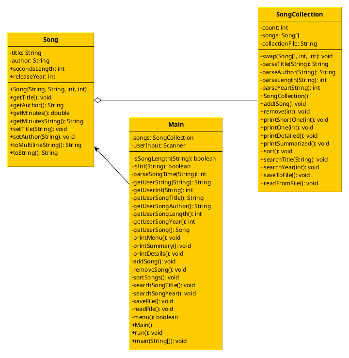

# AUK's Principles of Programming final project: Object Collection
This is ViceroyFaust's final project for American University Kyiv's Principles of Programming. While there might be some
poor practices in this program, they are most likely symptoms of project requirements and time restraints.

In this program the user has an ability to interact with a simple collection storing Song objects which contain song
title, name of song's creator, song length, and song's release year. The user may print the collection in multiple
formats, add and remove songs, sort by year, search by title and year, and save/read collection to file.

## UML Chart
